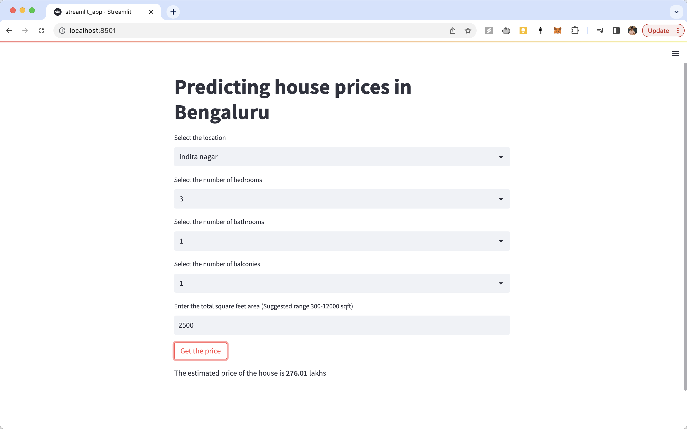

# House-price-prediction

In this project we're creating a house price predictor application for Bengaluru city in India ([Data(https://www.kaggle.com/datasets/amitabhajoy/bengaluru-house-price-data) used is publicly available on Kaggle)

## Functionalities 

- Basic EDA and Data cleaning 
- Model creation, and performance validation - Linear regression, Lasso regression & Decision Trees
- Saving the final model - Pickle
- Creating a Fastapi application 

## Demo UI 



## Steps to reproduce 
- Clone the repo
- Install requirements.txt
- In Server folder, up the fastapi 
```
uvicorn server:app --reload --port 8000
```
- In another terminal start the streamlit app
```
streamlit run streamlit_app.py
```

